## 计算机毕业设计Hadoop+LSTM美食大众点评情感分析预测 美食可视化 美食推荐系统 美食爬虫 机器学习 深度学习 Spark Hive数据仓库

## 要求
### 源码有偿！一套(论文 PPT 源码+sql脚本+教程)

### 
### 加好友前帮忙start一下，并备注github有偿hadoop美食分析
### 我的QQ号是2827724252或者798059319或者 1679232425或者微信:bysj2023nb

# 

### 加qq好友说明（被部分 网友整得心力交瘁）：
    1.加好友务必按照格式备注
    2.避免浪费各自的时间！
    3.当“客服”不容易，repo 主是体面人，不爆粗，性格好，文明人。
## 介绍
需要定制项目+付费源码查看主页
技术栈：spark、hadoop、hive、mysql、LSTM回归预测算法
觉得视频对你有帮助的同学记得点赞关注三连哦~
## 演示视频
https://www.bilibili.com/video/BV1BJBqYuEne/?spm_id_from=333.999.0.0
## 运行截图
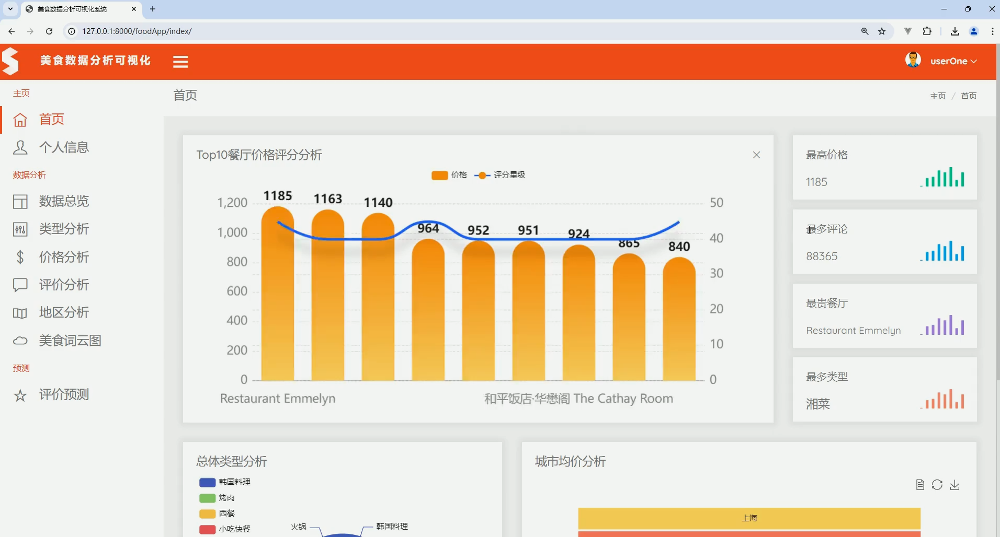
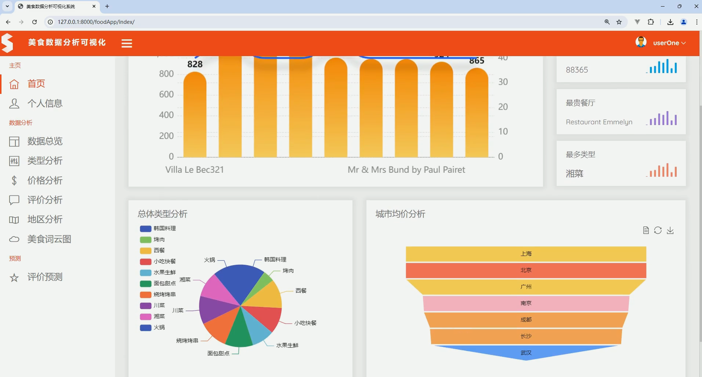
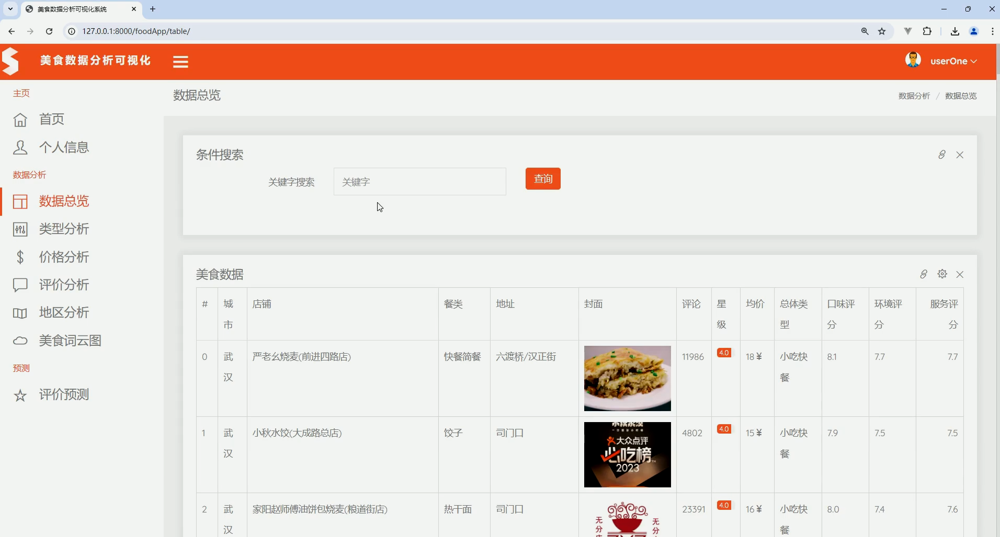
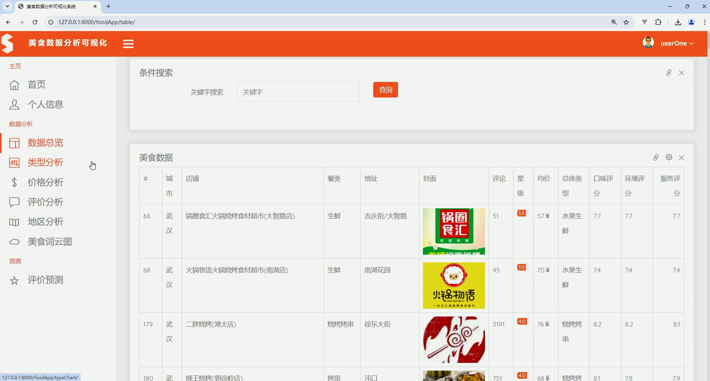
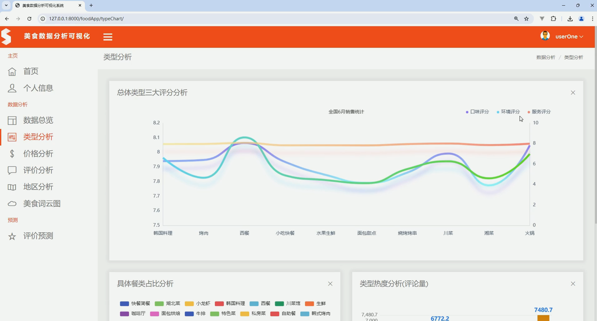
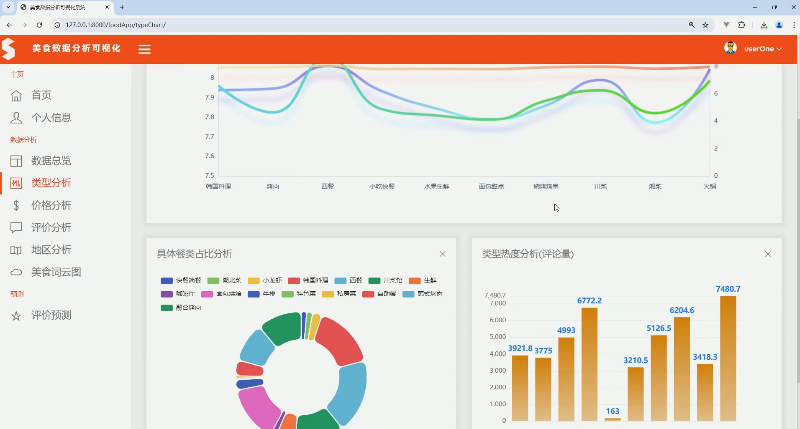
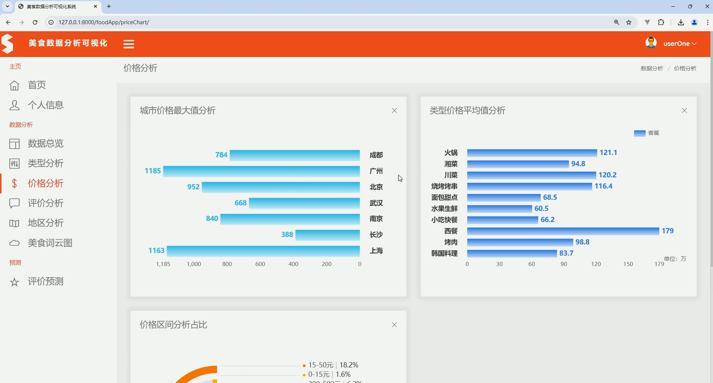
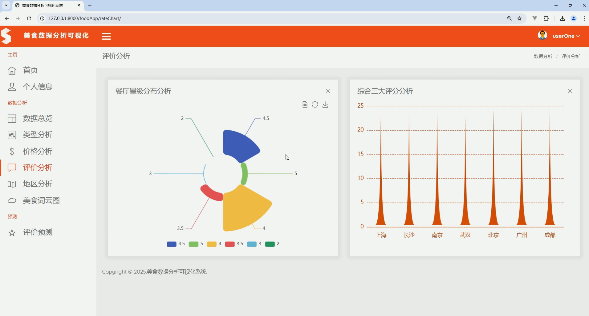
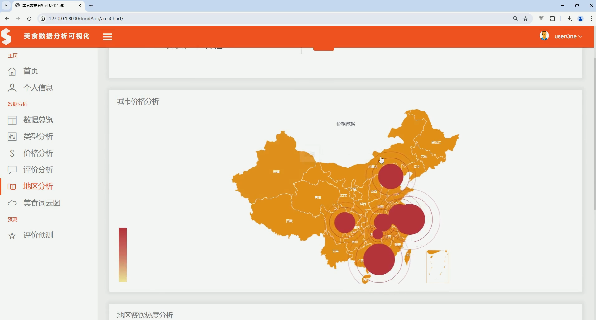
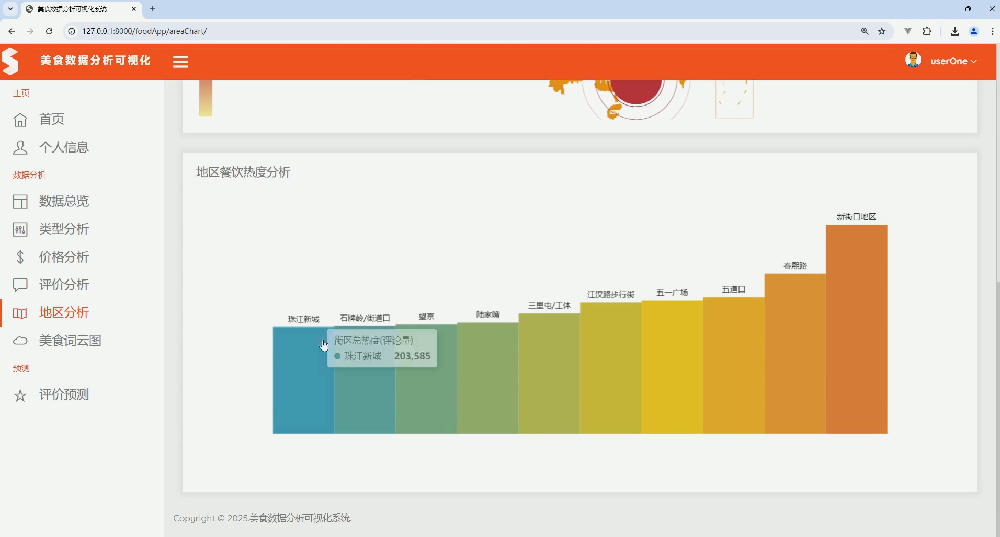
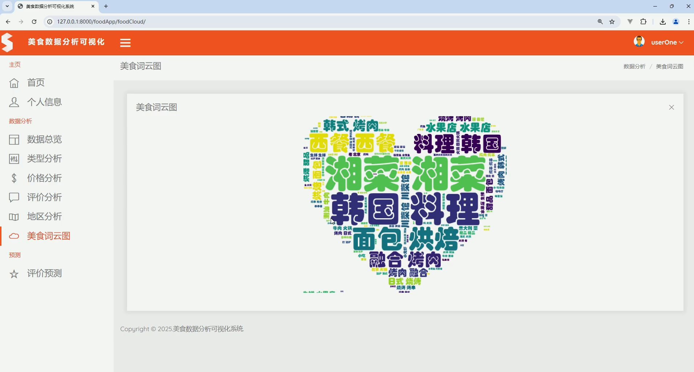
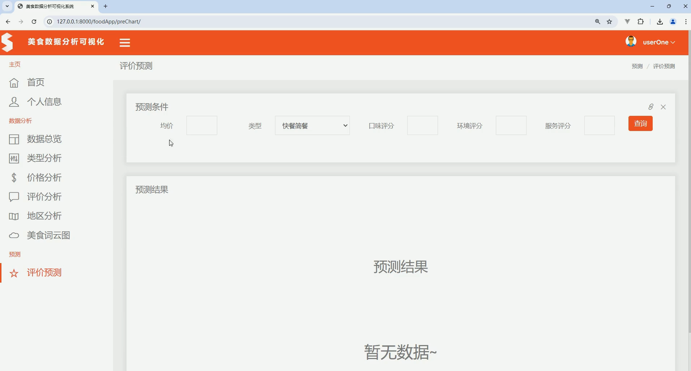
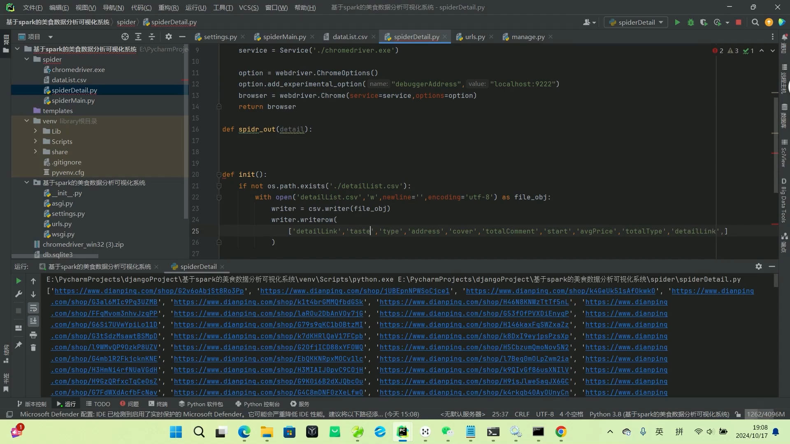
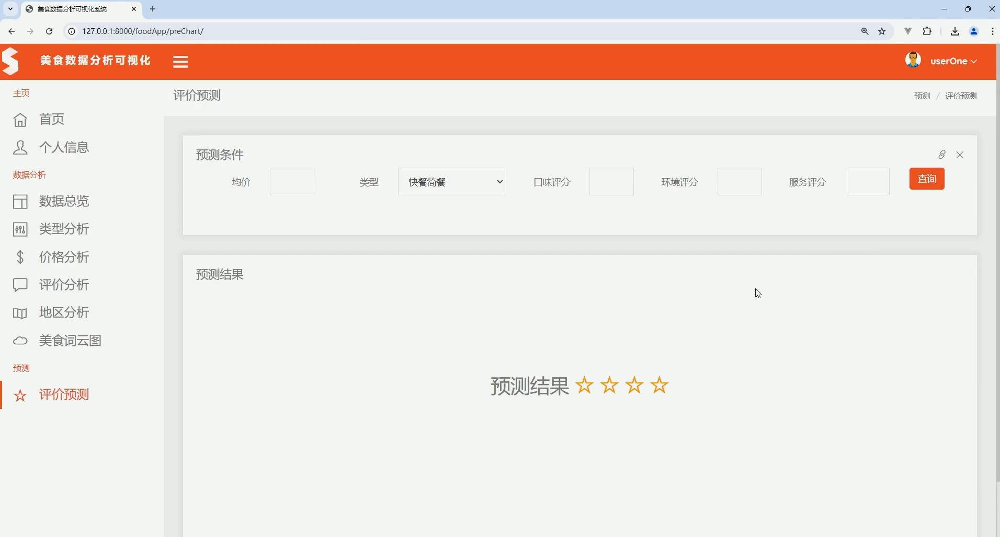

